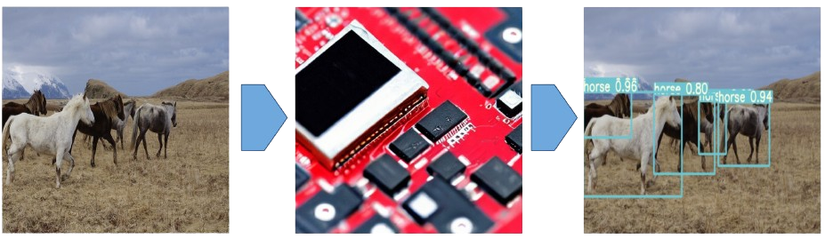

# Object detection on small and cost-efficient devices

#### Compress, Deploy and Infer Yolov7 on STM32 chips and low-energy microcontrollers

# YOLOv7 ONNX Inference

This repository contains code for performing inference using a YOLO (You Only Look Once) model that has been converted to ONNX (Open Neural Network Exchange) format. 

The primary goal of this project is to enable efficient and flexible deployment of YOLO models for object detection tasks, especially on STM32 chips.

## The project is divided into six main components:

1. **ONNX Model Conversion and Quantization into QInt8**
2. **Export the main core of YOLOv7 into ONNX**
3. **Python Inference engine for a Quantized and Compressed YOLOv7**
4. **C++ Inference engine for a Quantized and Compressed YOLOv7 (soon to come)**
5. **Apply various [STM32ai toolbox](https://stm32ai.st.com/)  features on a YOLO ! (soon to come)**
6. **Generate static code C of your model and deploy on low-cost microcontroller (soon to come)**

The intended pipeline is as follow : Train your object detector => Export it into ONNX => Quantize / Compress your model using ONNXRUNTIME or STM32ai => Run inference on Python on "large enough" => Deploy into microcontroller

The following table contains a benchmark test using tiny-yolov7 on different devices with certain optimizations
**TODO**

#### A fine amount of the software can be used for various neural networks as long as the layers are supported by ONNXRUNTIME and STM32ai
## License
This project is licensed under the  GNU License.

