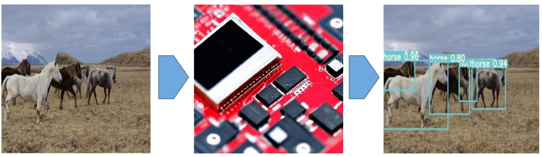

# YOLOv7 ONNX Inference for Embedded Systems

**Compress, Deploy and Infer YOLOv7 on STM32 chips and low-energy microcontrollers**



## Project Overview

This repository contains a comprehensive framework for performing inference using YOLO (You Only Look Once) models converted to ONNX (Open Neural Network Exchange) format, with a specific focus on deployment on embedded systems like STM32 microcontrollers.

The primary goal is to enable efficient and flexible deployment of YOLOv7 models for object detection tasks on resource-constrained devices through model quantization, compression, and optimized inference engines.

## Project Components

The project is organized into the following main modules:

1. **`yolov7/`** - Original YOLOv7 model implementation with training and deployment utilities
2. **`yolo-quant/`** - Model quantization tools to compress YOLOv7 into QInt8 format
3. **`onnx-python-inference/`** - Python inference engine for quantized and compressed YOLOv7 models
4. **`stm32_toolbox/`** - STM32AI toolbox integration and embedded C/C++ code generation
5. **`yolov7-export/`** - ONNX export tools for YOLOv7 model conversion

## Development Pipeline

The intended workflow for this project is:

```
Train Model → Export to ONNX → Quantize/Compress → Python Inference → Deploy to Microcontroller
```

**Detailed steps:**
1. Train your YOLOv7 object detector
2. Export the trained model to ONNX format
3. Quantize and compress the model using ONNXRUNTIME or STM32AI
4. Run inference tests on Python on desktop hardware
5. Generate optimized C code and deploy on STM32 microcontroller

## Key Features

- ✅ Full YOLOv7 model conversion to ONNX format
- ✅ Model quantization into QInt8 for reduced model size
- ✅ Python inference engine with optimized post-processing
- ✅ STM32AI integration for microcontroller deployment
- ⏳ C++ inference engine (in progress)
- ⏳ Automated static C code generation (coming soon)

## Supported Networks

The inference engines support various neural network architectures and layer types, as long as they are compatible with:
- ONNXRUNTIME
- STM32AI toolbox

## Project Structure

```
Embedded-Yolov7/
├── yolov7/                      # YOLOv7 training and model code
├── yolo-quant/                  # Quantization utilities
├── onnx-python-inference/       # Python inference implementation
├── stm32_toolbox/               # STM32 embedded deployment guide
├── images/                      # Documentation images
├── LICENSE.md
└── README.md
```

## Getting Started

1. Review the README in the specific module you want to work with:
   - For **training and exporting**: See `yolov7/README.md`
   - For **quantization**: See `yolo-quant/README.md`
   - For **Python inference**: See `onnx-python-inference/README.md`
   - For **STM32 deployment**: See `stm32_toolbox/README.md`

2. Install dependencies for your target module (see module-specific `requirements.txt`)

3. Follow the module-specific documentation for your use case

## License

This project is licensed under the GNU License. See `LICENSE.md` for details.


